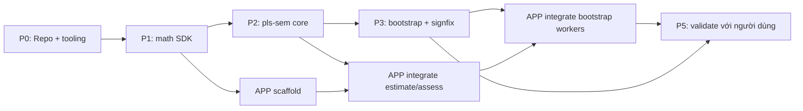

# Analyx — Implementation Plan

> Đi kèm `analyx-mvp-architecture.md` (đã approve). Tài liệu này là **kế hoạch thực thi task-level**: thứ tự, phụ thuộc, và *acceptance criteria* (điều kiện "xong") cho từng task. Nguyên tắc xuyên suốt: **không có task nào "xong" nếu chưa khớp số tham chiếu.**

## Cách dùng tài liệu

- Mỗi task có **Done-when** đo được. Không có Done-when mơ hồ kiểu "code chạy".
- **🚦 Gate** = checkpoint chặn: không qua thì không sang phase sau.
- Cột **Track** gợi ý phân việc nếu bạn delegate: `SDK` (bạn) · `APP` (frontend) · `QA` (golden fixtures + đối chiếu). Ba track chạy song song *sau* khi math xong.

## Đồ thị phụ thuộc (tổng quan)



Đường tới hạn (critical path): **P0 → P1 → P2 → P3 → APP integrate → validate.** Frontend scaffold có thể bắt đầu ngay sau P1.

---

## Phase 0 — Repo & tooling (Track: SDK) · ~2 ngày

| Task | Deliverable | Done-when |
|---|---|---|
| 0.1 Monorepo | pnpm workspaces: `packages/math`, `packages/pls-sem`, `apps/analyx` | `pnpm -r build` chạy không lỗi trên stub rỗng |
| 0.2 Build dual | tsup/unbuild cho 2 package → ESM + CJS + `.d.ts` | `dist/` có cả `.mjs`, `.cjs`, `.d.ts`; zero runtime deps trong `package.json` |
| 0.3 Test + lint | vitest + biome/eslint | `pnpm test` & `pnpm lint` xanh |
| 0.4 CI | GitHub Actions: typecheck + test mọi PR; **golden-test job là required check** | PR đỏ nếu golden test fail |
| 0.5 Kiểu dữ liệu chung | `Dataset` type (cột tên + `Float64Array` theo cột), convention Float64Array+dims | Doc ngắn trong `packages/math/CONVENTIONS.md` |

---

## Phase 1 — `@analyx-sdk/math` (Track: SDK) · ~1.5 tuần

> Mọi thứ phụ thuộc lớp này. Sai một chữ số ở đây = mọi thứ trên nó sai. Mỗi task đối chiếu R/scipy.

| Task | Hàm | Done-when (đối chiếu) |
|---|---|---|
| 1.1 Mat | `from2D`, `mul`, `transpose`, `identity`, `col` | Tích ma trận khớp tay/numpy, ≥1e-12 |
| 1.2 linalg | `qr`, `solve`, `inverse` (ưu tiên QR) | Khớp `numpy.linalg.solve` ≥1e-10 trên ma trận có điều kiện xấu vừa |
| 1.3 regression | `ols(X, y) → {coef, rSquared, adjRSquared, residuals, fitted}` | Khớp R `lm()` coef + R² ≥1e-8 trên dataset mẫu |
| 1.4 descriptive | `mean`, `variance` (n−1), `sd`, `standardize` | `standardize(x)` cho mean≈0, sd≈1 (≥1e-12) |
| 1.5 corr | `covarianceMatrix`, `correlationMatrix` (Pearson) | Khớp R `cor()` ≥1e-10 |
| 1.6 resample | `makeRNG(seed)`, `bootstrapIndices(n, B, rng)` | **Determinism:** cùng seed → cùng `Int32Array[]` byte-by-byte |
| 1.7 distributions | `StudentT.{cdf,quantile}`, `Normal.{cdf,quantile}` | Khớp `scipy.stats` ≥1e-6 |
| 1.8 quantile | `percentile(sortedAsc, p)` | **Ghi rõ method** (linear interpolation) + khớp `numpy.percentile` ≥1e-10 |
| 1.9 validate | `assertFinite/Dims/MinSample` | Throw đúng message trên input hỏng |

**🚦 Gate G1:** toàn bộ math golden tests xanh vs R/scipy. **Không động vào pls-sem trước khi G1 pass.**

---

## Phase 2 — `@analyx-sdk/pls-sem` core (Track: SDK; QA chuẩn bị fixtures song song) · ~2 tuần

### 2.0 Golden fixtures (Track: QA — làm ngay từ đầu phase)
- Lấy **dataset Corporate Reputation** (mô hình mẫu chuẩn trong Hair et al., *A Primer on PLS-SEM*) — dataset này ship sẵn trong SmartPLS làm example project.
- Chạy SmartPLS trên chính nó, **ghi lại từng số**: outer weights, loadings, CR, AVE, Cronbach α, ρA, Fornell-Larcker, HTMT, path coeff, R², f², và (sau) bootstrap t-values.
- Encode thành `fixtures/corp-reputation.expected.json`.
- **Đây là nguồn chân lý.** Reviewer tin SmartPLS → ta phải khớp SmartPLS, không phải khớp "lý thuyết".

### 2.1 Model spec & validate

| Task | Done-when |
|---|---|
| `ModelSpec`, `ConstructSpec`, `PathSpec` | Serialize/deserialize JSON round-trip |
| `validateModel` | Bắt lỗi: construct thiếu indicator; structural có cycle; path trỏ tới construct không tồn tại |

### 2.2 Algorithm — `estimate()` (tim của hệ)

Pseudocode Mode A (Lohmöller), implement theo đúng các bước:

```
standardize tất cả indicators -> X
khởi tạo outer weights w (đều = 1)
lặp tới hội tụ (tol = 1e-7, maxIter = 300):
  # 1. outer approximation
  for mỗi construct c:
     score[c] = standardize( X[indicators(c)] · w[c] )
  # 2. inner approximation (theo scheme, mặc định 'path')
  tính inner weights e giữa các construct kề:
     centroid: e[c][b] = sign(corr(score[c], score[b]))
     factor:   e[c][b] = corr(score[c], score[b])
     path:     successor -> corr ; predecessor -> hệ số ols(score[c] ~ predecessors)
  for mỗi construct c:
     inner[c] = standardize( Σ_b e[c][b] · score[b] )   # b kề c
  # 3. outer weights update
  for mỗi construct c:
     mode A: w_new[c][i] = cov(inner[c], X[indicator_i])   # từng indicator
     mode B: w_new[c]    = ols(X[indicators(c)], inner[c]).coef
  # 4. hội tụ
  nếu max|w_new - w| < tol: break ; ngược lại w = w_new
final:
  scores[c]   = standardize( X[indicators(c)] · w[c] )
  loadings[c][i] = corr(X[indicator_i], scores[c])   # loadings phản ánh
```

| Task | Done-when |
|---|---|
| `schemes.ts` (centroid/factor/path) | Mỗi scheme cho kết quả ổn định trên model test nhỏ |
| `estimate()` | Hội tụ < 300 vòng trên corp-reputation; **outer weights + loadings khớp fixture ≥3 chữ số** |

### 2.3 Measurement assessment

| Task | Công thức | Done-when |
|---|---|---|
| loadings, indicator reliability | λ, λ² | khớp fixture ≥3 cs |
| CR (ρc) | (Σλ)²/[(Σλ)²+Σ(1−λ²)] | khớp ≥3 cs |
| AVE | mean(λ²) | khớp ≥3 cs |
| Cronbach α, ρA | — | khớp ≥3 cs |
| Fornell-Larcker | √AVE vs inter-construct corr | ma trận khớp ≥3 cs |
| **HTMT** | tỉ số hetero/mono-trait (arithmetic — **ghi rõ biến thể**) | khớp ≥3 cs |
| cross-loadings | corr indicator ↔ mọi construct | khớp ≥3 cs |

### 2.4 Structural assessment

| Task | Công thức | Done-when |
|---|---|---|
| path coeff, R², adjR² | `ols(score nội sinh ~ predecessors)` | khớp fixture ≥3 cs |
| f² | (R²_in − R²_out)/(1 − R²_in) | khớp ≥3 cs |
| VIF | từ R² mỗi predictor ~ các predictor khác | khớp ≥3 cs |

**🚦 Gate G2 (gate niềm tin):** `assess()` trên corp-reputation khớp SmartPLS **≥3 chữ số ở MỌI chỉ số đo lường + cấu trúc.** Đây là gate sống còn của cả sản phẩm.

---

## Phase 3 — `inference/bootstrap` + `signfix` (Track: SDK) · ~1 tuần

### 3.1 Thiết kế tái lập (quan trọng — quyết định trước khi code)
- **Sinh toàn bộ B bộ resample-index một lần trên một seed** (`bootstrapIndices(n, B, seed)`), rồi **chia partition** cho workers. ⇒ kết quả **độc lập với số lượng worker** (deterministic dù máy 4 core hay 16 core). Đừng để mỗi worker tự seed riêng — sẽ khó tái lập.
- `estimate()` phải là **pure function** gọi được trong worker (không đụng DOM/global).

### 3.2 `bootstrap()`

```
indices = bootstrapIndices(n, B, seed)         # B mẫu, sinh 1 lần
for mỗi mẫu b:
  est_b = estimate(model, data[indices[b]], seed=...)
  signfix(est_b, est_original)                 # SỬA DẤU trước khi gom
  assess_b = assess(model, est_b)
  thu path/loadings/htmt của est_b vào mảng phân phối
cho mỗi tham số θ:
  SE   = sd(phân phối θ)
  t    = θ_original / SE
  p    = 2 * (1 - StudentT.cdf(|t|, df = B - 1))
  CI   = [percentile(θ_dist, 2.5), percentile(θ_dist, 97.5)]   # percentile CI
```

### 3.3 `signfix()` — lỗi kinh điển làm lệch SmartPLS
PLS có bất định dấu ở cấp construct. Mỗi lần bootstrap, một construct có thể bị lật dấu → SE phồng giả. Sửa theo **construct-level sign correction** (mặc định SmartPLS):

```
cho mỗi construct c:
  nếu corr(loadings_boot[c], loadings_original[c]) < 0:   # vector loadings bị đảo
     đảo dấu: weights[c], loadings[c], scores[c]  *= -1
     điều chỉnh dấu các path coeff có liên quan tới c
```

| Task | Done-when |
|---|---|
| `bootstrap()` (single-thread trước) | chạy đúng logic trên B=5000 |
| `signfix()` | bật/tắt signfix cho thấy SE khác biệt rõ; bật = số ổn định |
| Đối chiếu | **bootstrap t-values khớp SmartPLS ~2 chữ số** trên corp-reputation (seed cố định, B=5000, construct-level sign change — đúng cấu hình mặc định SmartPLS) |

**🚦 Gate G3:** t-values & CI khớp SmartPLS trong dung sai (bootstrap có dao động lấy mẫu → cố định seed + nêu rõ cấu hình). Qua G3 = SDK đủ để làm sản phẩm.

---

## Phase 4 — Analyx web app · ~3 tuần (Track: APP, bắt đầu scaffold sau G1)

### 4.0 Scaffold (sau G1)
| Task | Done-when |
|---|---|
| Vite + React + TS, Zustand store | `pnpm dev` chạy; deploy thử Cloudflare Pages xanh |

### 4.1 Data import (client-side)
| Task | Done-when |
|---|---|
| papaparse (CSV) + SheetJS (XLSX), parse trong browser | Import file → data grid preview; **network tab xác nhận KHÔNG có upload** |

### 4.2 Model builder (sau G2)
| Task | Done-when |
|---|---|
| React Flow: construct node, gắn indicator, vẽ path, chọn mode A/B | Vẽ xong corp-reputation model → serialize ra `ModelSpec` đúng |

### 4.3 Compute — worker pool (sau G3)
| Task | Done-when |
|---|---|
| Spawn `navigator.hardwareConcurrency` workers | — |
| Protocol: main sinh `indices` → chia partition → gửi (model+data+partition) | Kết quả **giống hệt** dù 4 hay 16 core (test tái lập) |
| Merge partial + `onProgress` | Progress bar chạy; UI không đơ khi B=5000 |

### 4.4 Results UI
| Task | Done-when |
|---|---|
| Bảng measurement / structural / bootstrap | Số trên UI khớp output SDK |
| Path diagram annotate hệ số trên edge | Coeff + significance hiện đúng trên diagram |

### 4.5 Export + reproducibility
| Task | Done-when |
|---|---|
| Export CSV + bảng HTML copy-paste vào Word | Bảng đúng format Hair (loadings, CR/AVE, FL, **HTMT**, path+CI+t+p) |
| Project save/load JSON (kèm seed) | Mở lại project → re-run ra **đúng cùng số** |
| Reproducibility bundle (model + seed) | Người khác nạp cùng data → cùng kết quả |
| Privacy banner | UI nói rõ "data không rời browser" |

**🚦 Gate G4 (end-to-end):** người lạ import data → vẽ model → chạy → bảng HTMT + bootstrap CI **khớp SmartPLS** → export — không cài gì, trong browser.

---

## Phase 5 — Validate với người dùng thật · song song từ cuối P4

Không build thêm feature ở đây. Đưa cho **3–5 nghiên cứu sinh / 1–2 trưởng lab** từng dùng SmartPLS, test ba câu:
1. Họ có đụng trần SEM của JASP/jamovi không?
2. Tool web no-install + HTMT/bootstrap đầy đủ + reviewer-ready + share-link tái lập — đủ để **đổi/trả tiền** không?
3. **Ai cầm ngân sách** — cá nhân hay khoa?

**Done-when:** ít nhất 1 người nói "tôi sẽ dùng cái này thay SmartPLS" *và* chỉ ra được ai trả tiền.

---

## Checkpoint rủi ro (map vào 3 rủi ro ở spec)

| Gate | Chặn rủi ro | Nếu fail |
|---|---|---|
| G1 | math sai ngầm | dừng, không lên pls-sem |
| **G2** | **không khớp SmartPLS** (rủi ro #1) | dừng — đây là rủi ro giết sản phẩm; debug signfix/scheme/HTMT-variant |
| G3 | bootstrap lệch | kiểm tra sign correction + cấu hình resample |
| G4 | bootstrap đơ UI / không tái lập | kiểm worker partition + seed; cân nhắc WASM (đo trước) |

## Thứ tự ưu tiên nếu thiếu thời gian

P0 → P1 → P2 (tới Gate G2) → P3 → P4.4/4.5 tối thiểu → P5.
**Cắt được:** export .docx (HTML-table là đủ cho MVP), share-link nâng cao, scheme factor/centroid (chỉ cần `path` mặc định).
**Không cắt được:** G2 (khớp số), signfix, worker pool, HTMT.
