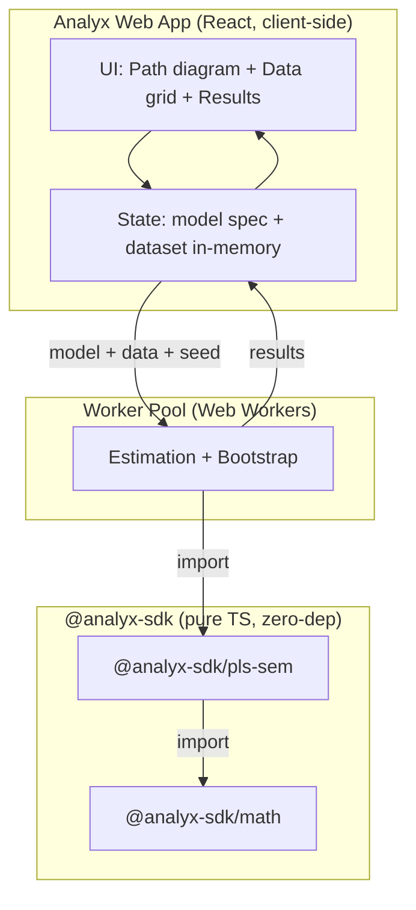
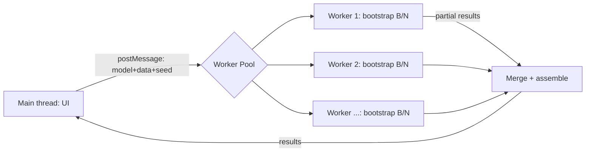

# Analyx — MVP Scope & Kiến trúc kỹ thuật

> **Mục tiêu MVP (một câu):** Chạy trọn một mô hình **PLS-SEM phản ánh (reflective, Mode A)** đạt chuẩn báo cáo reviewer — bao gồm measurement model, structural model, HTMT và bootstrapping — **hoàn toàn trong trình duyệt, dữ liệu không rời máy người dùng.**

Thắng-thua không nằm ở "có làm PLS-SEM hay không" (JASP/cSEM làm rồi), mà ở: **đủ sâu để vượt free tools + no-install + reproducible + output reviewer-ready.** MVP phải chứng minh đúng ba thứ đó.

---

## 0. Scope: In / Out

| Hạng mục | MVP (v2026.0.1-alpha) | Fast-follow (ngay sau khi validate) | Để sau |
|---|---|---|---|
| Measurement | Loadings, indicator reliability, CR (ρc), AVE, Cronbach α, ρA, Fornell-Larcker, **HTMT**, cross-loadings | Formative (Mode B): weights, VIF chỉ báo, significance | — |
| Structural | Path coeff, R², adj R², **f²**, collinearity (VIF) | **Q² (blindfolding)**, PLSpredict (k-fold) | — |
| Inference | **Bootstrapping** (SE, t, p, percentile CI) cho weights/loadings/paths/HTMT | BCa CI; bootstrap cho f²/Q² | — |
| Effects | Direct effects | **Mediation** (specific/total indirect), **Moderation** | — |
| Đa nhóm | — | **MGA** (permutation + parametric), **MICOM** 3 bước | — |
| Mô hình nâng cao | — | Consistent PLS (PLSc), higher-order constructs | Model fit (SRMR/NFI/GoF) |
| App I/O | Import CSV/XLSX (client-side), path diagram drag-drop, bảng kết quả, export CSV + bảng reviewer-ready | Export Word/PDF báo cáo, share-link tái lập | Collaboration real-time |

**Nguyên tắc cắt scope:** MVP = đủ để một nghiên cứu sinh chạy xong **Chương 4 reflective model** và nộp được. Mediation/MGA tuy phổ biến nhưng để fast-follow — vì measurement + bootstrapped paths + HTMT đúng số mới là "credibility core". Sai một con số ở đây là mất niềm tin vĩnh viễn.

---

## 1. Kiến trúc ba lớp



**Luồng dữ liệu:** CSV/XLSX → parse client-side → dataset in-memory → người dùng vẽ model → `estimate(model, data, seed)` chạy trong worker → results object → render bảng + diagram + export. **Không có backend tính toán. Không upload.** Đây là moat privacy, phải hiển thị rõ trên UI ("Your data never leaves this browser").

**Ranh giới open-core:** `math` = MIT. `pls-sem` free tier = algorithm + measurement cơ bản + structural cơ bản + Fornell-Larcker. `pls-sem` Pro = bootstrapping, HTMT, f²/Q², mediation, moderation, MGA, MICOM. App gate Pro features theo đúng ranh giới này.

---

## 2. `@analyx-sdk/math`

**Vai trò:** engine số học thuần, không biết gì về PLS-SEM. `pls-sem` là khách hàng đầu tiên, nhưng API phải generic để các SDK sau (spss, v.v.) tái dùng.

**Ràng buộc thiết kế (không thương lượng):**
- Zero runtime deps, pure TS, ESM + CJS dual, tree-shakeable (mỗi module import độc lập).
- **Deterministic:** mọi thứ ngẫu nhiên đi qua PRNG có seed. Cùng seed → cùng kết quả, mọi máy. Đây là nền của reproducibility.
- **Hot path dùng `Float64Array` + flat array + dims tường minh**, không phải `number[][]`. Bootstrap 5000 lần × tái ước lượng → cấp phát/GC là kẻ thù.
- Mỗi hàm thuần (pure), không side-effect, không throw trừ validation đầu vào.

**Module cần cho PLS-SEM MVP** (tập con của toàn bộ math):

```
@analyx-sdk/math
├── matrix/        # Mat (Float64Array-backed): mul, transpose, identity, sub-view
├── linalg/        # solve (linear system), qr, inverse — ưu tiên QR cho ổn định số
├── regression/    # ols(X, y) -> { coef, residuals, rSquared, fitted }
├── descriptive/   # mean, variance, sd, standardize (z-score)
├── corr/          # covarianceMatrix, correlationMatrix (Pearson)
├── resample/      # PRNG (seeded), bootstrapIndices(n, B, seed), kFoldSplit
├── distributions/ # StudentT { cdf, quantile }, Normal { cdf, quantile }
├── quantile/      # percentile(sorted, p) — cho bootstrap CI
└── validate/      # assertFinite, assertDims, assertMinSample
```

**API sketch (chữ ký, không phải implementation):**

```ts
// matrix/
export class Mat {
  readonly rows: number; readonly cols: number; readonly data: Float64Array;
  static from2D(a: number[][]): Mat;
  mul(b: Mat): Mat;
  transpose(): Mat;
  col(j: number): Float64Array;
}

// regression/  — dùng cho path coeff (structural) và Mode B (formative)
export interface OLSResult {
  coef: Float64Array;       // hệ số hồi quy
  rSquared: number;
  adjRSquared: number;
  residuals: Float64Array;
  fitted: Float64Array;
}
export function ols(X: Mat, y: Float64Array): OLSResult; // solve normal eq qua QR

// descriptive/
export function standardize(x: Float64Array): Float64Array; // z-score, mean 0 sd 1

// corr/
export function correlationMatrix(data: Mat): Mat;

// resample/
export interface RNG { next(): number; } // uniform [0,1)
export function makeRNG(seed: number): RNG;
export function bootstrapIndices(n: number, B: number, rng: RNG): Int32Array[]; // B mẫu, mỗi mẫu n chỉ số (có hoàn lại)

// distributions/
export const StudentT: { cdf(t: number, df: number): number; quantile(p: number, df: number): number; };

// quantile/
export function percentile(sortedAsc: Float64Array, p: number): number; // p in [0,100]
```

**Kiểm thử math:** đối chiếu từng hàm với R/Python tới ≥10 chữ số (vd `ols` vs `lm()`, `StudentT.cdf` vs `scipy.stats.t.cdf`). Math sai thì mọi thứ trên nó sai.

---

## 3. `@analyx-sdk/pls-sem`

**Module structure:**

```
@analyx-sdk/pls-sem
├── model/         # đặc tả model: constructs, indicators, mode (A/B), paths
│   ├── spec.ts        # ModelSpec, ConstructSpec, PathSpec (data structures)
│   └── validate.ts    # kiểm tra model hợp lệ (đủ indicator, không cycle ở structural, v.v.)
├── algorithm/     # core PLS-PM iterative estimation
│   ├── estimate.ts    # vòng lặp chính: outer/inner approximation -> weights, scores
│   ├── schemes.ts     # inner weighting: centroid | factor | path
│   └── converge.ts    # tiêu chí hội tụ (Δweights < tol)
├── measurement/   # reflective assessment
│   ├── reliability.ts # loadings, CR(ρc), AVE, Cronbach α, ρA
│   └── validity.ts    # Fornell-Larcker, HTMT, cross-loadings
├── structural/    # path coeff, R², adjR², f², VIF
├── inference/     # bootstrapping: SE, t, p, CI cho mọi tham số
│   ├── bootstrap.ts   # chạy lại estimate() B lần trên mẫu resample
│   └── signfix.ts     # sửa bất định dấu (sign indeterminacy) giữa các lần bootstrap
├── report/        # gom kết quả -> ResultsObject + bảng reviewer-ready
└── index.ts       # estimate(), assess(), bootstrap() — public API
```

**Pipeline thuật toán PLS-PM (Mode A — phần MVP):**

1. Standardize toàn bộ indicators (z-score).
2. Khởi tạo outer weights (đều nhau hoặc indicator đầu = 1).
3. **Lặp tới hội tụ:**
   - *Outer approximation:* construct score = tổ hợp có trọng số của indicators → standardize.
   - *Inner approximation:* tính inner weights giữa các construct kề nhau theo `scheme` (centroid/factor/path) → inner-approximated score.
   - *Outer weights update:* Mode A = covariance giữa inner-approx score và từng indicator; Mode B = hệ số hồi quy bội của score lên các indicator (dùng `math/regression`).
   - *Kiểm tra hội tụ:* Δ outer weights < tol (vd 1e-7) hoặc đạt max iter.
4. **Output thô:** outer weights, loadings (corr indicator↔final score), construct scores.

**Map checklist → module:**

| Chỉ số reviewer đòi | Module | Công thức cốt lõi |
|---|---|---|
| Loadings, indicator reliability | measurement/reliability | λ = corr(indicator, score); rel = λ² |
| CR (ρc) | measurement/reliability | (Σλ)² / [(Σλ)² + Σ(1−λ²)] |
| AVE | measurement/reliability | mean(λ²) |
| Cronbach α, ρA | measurement/reliability | — |
| Fornell-Larcker | measurement/validity | √AVE so với inter-construct corr |
| **HTMT** | measurement/validity | tỉ số trung bình corr heterotrait / monotrait |
| Path coeff, R², adjR² | structural | OLS score nội sinh ~ score dự báo (math/regression) |
| **f²** | structural | (R²_in − R²_out)/(1 − R²_in) |
| VIF (collinearity) | structural | từ R² của mỗi predictor lên các predictor còn lại |
| SE, t, p, CI | inference/bootstrap | phân phối bootstrap → percentile(2.5, 97.5) |

**Public API sketch:**

```ts
// model/spec.ts
export type Mode = 'A' | 'B';
export interface ConstructSpec { name: string; indicators: string[]; mode: Mode; }
export interface PathSpec { from: string; to: string; }
export interface ModelSpec {
  constructs: ConstructSpec[];
  paths: PathSpec[];
  scheme?: 'centroid' | 'factor' | 'path'; // mặc định 'path'
}

// index.ts
export interface Estimate {
  outerWeights: Record<string, number[]>;
  loadings: Record<string, number[]>;
  scores: Mat;               // n × số construct
  iterations: number;
  converged: boolean;
}
export interface Assessment {
  measurement: { cr; ave; cronbachAlpha; rhoA; fornellLarcker; htmt; crossLoadings };
  structural: { paths; rSquared; adjRSquared; fSquared; vif };
}
export interface BootstrapResult {
  // mỗi tham số: { estimate, se, tValue, pValue, ciLower, ciUpper }
  paths: Record<string, ParamStat>;
  loadings: Record<string, ParamStat>;
  htmt: Record<string, ParamStat>;
}

export function estimate(model: ModelSpec, data: Dataset, seed: number): Estimate;
export function assess(model: ModelSpec, est: Estimate): Assessment;
export function bootstrap(
  model: ModelSpec, data: Dataset,
  opts: { samples: number; seed: number; onProgress?: (done: number) => void }
): BootstrapResult;
```

**Hai điểm dễ sai (correctness gotchas):**
1. **Sign indeterminacy.** Mỗi lần bootstrap, construct/indicator có thể bị lật dấu so với mẫu gốc → SE phồng giả. Phải có `signfix`: chuẩn hóa dấu mỗi lần lặp về cùng quy chiếu với estimate gốc (construct sign correction). Đây là lỗi kinh điển khiến số lệch SmartPLS.
2. **HTMT đúng định nghĩa.** Có vài biến thể (HTMT, HTMT2/geometric). MVP làm HTMT chuẩn (arithmetic) — đúng cái SmartPLS/Hair báo cáo — và ghi rõ biến thể trong output.

---

## 4. Analyx web app

**Stack đề xuất (MVP):**
- **Vite + React + TypeScript** (SPA thuần client-side — đơn giản, mọi thứ chạy ở browser, không lẫn lộn SSR). *Next.js static export cũng được nếu bạn quen hơn; nhưng MVP ưu tiên SPA cho rõ ràng "all client-side".*
- **Cloudflare Pages** để host (đúng hệ sinh thái bạn rành; static = rẻ, scale tự nhiên).
- State: **Zustand** (đủ cho MVP, tránh over-engineer Redux).
- Path diagram: **React Flow** (node = construct, sub-node = indicator, edge = path). Đây là UX researcher nhận ra ngay từ SmartPLS — không có nó thì không "tương đương trải nghiệm".
- Data import: **papaparse** (CSV) + **SheetJS/xlsx** (Excel), parse hoàn toàn client-side.
- Bảng/chart: bảng tự render; diagram annotate hệ số trực tiếp trên edge.

**Compute architecture — điểm sống còn:**



- Estimation + bootstrap chạy trong **Web Worker pool**, KHÔNG ở main thread (nếu không UI đơ khi bootstrap 5000 lần).
- **Parallelize bootstrap qua N workers:** chia B mẫu cho `navigator.hardwareConcurrency` workers. Mỗi worker nhận **seed offset** (seed + workerIndex) → vừa song song vừa **vẫn deterministic và tái lập được**. Đây là lúc thiết kế pure + seeded của `math` trả cổ tức.
- `onProgress` callback → progress bar (bootstrap mất vài giây, phải cho người dùng thấy tiến độ).

**Privacy & reproducibility (đây là sản phẩm, không phải tính năng phụ):**
- Hiển thị rõ: dữ liệu xử lý 100% trong browser, không gửi đi đâu.
- **Project = JSON** gồm: model spec + tham chiếu schema dữ liệu + seed + (tùy chọn) kết quả. Lưu/mở local.
- **Reproducibility bundle:** export một file chứa model + seed; ai có cùng dữ liệu chạy lại ra **đúng cùng số** (nhờ seed). Lưu ý nghịch lý: "data không rời browser" ⇒ share-link không thể kèm dữ liệu mặc định. Thiết kế: chia sẻ **model + seed**; người nhận tự nạp dữ liệu để re-run. (Tùy chọn nâng cao: bundle có-data, người dùng chủ động opt-in.)

**Export reviewer-ready (lý do người ta trả tiền):** bảng đúng format Hair et al. — bảng loadings, bảng CR/AVE, ma trận Fornell-Larcker, **bảng HTMT**, bảng path + bootstrap CI + t + p. MVP: export CSV + HTML-bảng copy-paste được vào Word. Fast-follow: file .docx báo cáo hoàn chỉnh.

---

## 5. Cross-cutting concerns

**Numerical validation (bắt buộc, là điều kiện sống còn):**
- Ship một **golden test suite** tái tạo các dataset ví dụ đã công bố — đặc biệt **corporate reputation dataset** trong sách Hair et al. (A Primer on PLS-SEM) — và đối chiếu **từng con số** (loadings, CR, AVE, HTMT, paths, bootstrap t-values) với SmartPLS tới ≥3 chữ số.
- Reviewer tin SmartPLS. Nếu Analyx ra số khác → bị nghi sai, dù bạn đúng. Khớp số = giấy thông hành.

**Performance:**
- MVP: pure TS trong worker pool là đủ cho cỡ mẫu academic điển hình (n < 1000, < 10 constructs, B = 5000).
- Escape hatch nếu chậm: chuyển vòng lặp nóng (re-estimate trong bootstrap) sang **WASM (Rust/AssemblyScript)** sau — nhưng ĐỪNG làm sớm, đo trước đã.

**Open-core gating trong app:**
- Free: estimate + measurement cơ bản + Fornell-Larcker + structural cơ bản.
- Pro (gate): bootstrapping, HTMT, f², (fast-follow: Q², mediation, MGA...).
- Validate giai đoạn đầu: có thể mở hết để lấy usage, gắn gate sau khi xác nhận có người dùng.

---

## 6. Build & release

- **Monorepo** (pnpm workspaces hoặc Turborepo): `packages/math`, `packages/pls-sem`, `apps/analyx`.
- Output **ESM + CJS dual**, `.d.ts` đầy đủ, zero runtime deps cho 2 package SDK.
- Version: `2026.0.1-alpha` đồng bộ 3 phần.
- CI: chạy golden test suite (đối chiếu SmartPLS/R) ở mỗi PR — coi như test chặn merge.

---

## 7. Top 3 rủi ro kỹ thuật + mitigation

| Rủi ro | Hệ quả nếu bỏ qua | Mitigation |
|---|---|---|
| **Số không khớp SmartPLS** (sign indeterminacy, biến thể HTMT, hội tụ) | Mất niềm tin reviewer → sản phẩm vô dụng dù chạy được | Golden test suite vs Hair dataset; `signfix`; ghi rõ biến thể công thức |
| **Bootstrap đơ trình duyệt** | Trải nghiệm tệ, người dùng bỏ đi | Worker pool + parallel theo seed offset + progress bar; WASM là escape hatch (đo trước) |
| **UX path diagram không "ra dáng SmartPLS"** | Researcher không thấy quen → không đổi | React Flow cho diagram drag-drop ngay từ MVP; không hạ cấp thành form |

---

## 8. Thứ tự build gợi ý (~8 tuần)

1. **Tuần 1–2:** `@analyx-sdk/math` các module PLS cần + golden tests vs R (`ols`, `correlationMatrix`, `StudentT`, `bootstrapIndices`).
2. **Tuần 2–4:** `@analyx-sdk/pls-sem` algorithm + measurement + structural; validate vs Hair corporate reputation dataset (chưa cần bootstrap).
3. **Tuần 4–5:** `inference/bootstrap` + `signfix`; khớp t-values với SmartPLS.
4. **Tuần 5–7:** App — import dữ liệu, React Flow path builder, gọi worker pool, render bảng + diagram annotate.
5. **Tuần 7–8:** Export reviewer-ready + project save/load + seed reproducibility; deploy Cloudflare Pages; đưa cho 3–5 nghiên cứu sinh thật dùng thử.

**Định nghĩa "MVP xong":** một người lạ nạp dữ liệu khảo sát của họ, vẽ model reflective, bấm chạy, và nhận lại bảng HTMT + bootstrap CI **khớp SmartPLS**, không cài gì, trong browser — rồi nói "tôi sẽ dùng cái này thay SmartPLS".
